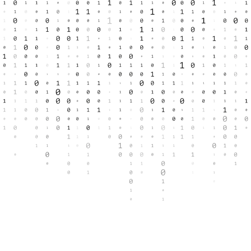

# 🎓 Akad Academy

## Akad Academy

### Decentralized Academic Platform for Autodidacts

#### An overview and summary of implementing a decentralized university and college blockchain platform that empowers the autodidact with no centralized boundaries or borders found within a traditional or centralized educational system.

## 🎓Table of Contents

### &#x20;Introduction

* Background on the need for a decentralized education platform
* Overview of the proposed platform

### Blockchain and Decentralization

* Explanation of blockchain technology
* Overview of Proof of Stake Consensus Mechanism
* Benefits of using a blockchain for education

### Platform Design and Architecture

* Description of platform components
* Tokenization of student identities courses and achievements\
  (including degrees and certifications)
* Overview of intelligent smart contract functionality

### Governance and Incetiviatzation

* Description of platform governance structure
* Incentivization mechanisms for participation
* Token economy and revenue streams

### Use Cases and Applications

* Student-centric use cases
* Teacher-centric use cases
* Online course offerings

### Implementation and Roadmap

* Technical implementation details
* Timeline for platform development and roll-out
* Future considerations and scalability

### Conclusion

* Summary of key points
* Benefits of the proposed platform
* Call to action for participation and investment\

## Glossary of Terminology

| Term | Definition |
| ---- | ---------- |
|      |            |
|      |            |
|      |            |
|      |            |
|      |            |
|      |            |
|      |            |
|      |            |
|      |            |
|      |            |
|      |            |
|      |            |
|      |            |
|      |            |
|      |            |
|      |            |
|      |            |

## 🎓Akad Academy Introduction: 1.1

### Background on he need for a decentralized education platform

The traditional education system has been the backbone of society for centuries. Still, it is becoming increasingly evident that it is facing numerous challenges in the 21st century. Issues such as high tuition fees, limited access to quality education, lack of customization, and lack of recognition of non-traditional learning methods have all led to a growing need for an alternative education system. The decentralization of education offers a promising solution to these challenges.

#### Background:&#x20;

The need for a decentralized education platform, like DUCA, stems from several critical problems faced by the current education system. Firstly, the high cost of tuition fees and student loans has made education increasingly unaffordable for a large segment of the population. Secondly, the traditional education system does not offer enough customization, making it challenging for students to find courses that match their learning styles and career goals. Furthermore, non-traditional forms of learning, such as online courses, are often not recognized by traditional universities, leaving students without any credible way to provide their competencies.

DUCA is a decentralized education platform that aims to address these challenges by providing an alternative learning experience. With DUCA, students have access to a wide range of courses, many of which are free, and can choose to learn at their own pace. Additionally, DUCA recognizes and certifies non-traditional forms of learning, providing students with a way to prove their own competencies and advance their careers.

By leveraging the benefits of decentralized blockchain technology, such as increased transparency and accessibility, DUCA offers a more democratic and inclusive education experience that is more accessible, customizable, and inclusive.

## 🎓Akad Academy Introduction: 1.2

### Overview of the proposed platform

DUCA is a decentralized education platform designed to provide a more accessible, customizable, and inclusive education experience. The platform operates on blockchain technology, ensuring the security and immutability of students' records and certifications.

DUCA offers a wide range of courses, many of which are free, and students can choose their learning pace. The platforms also recognize and certify non-traditional forms of learning, providing students with a way to prove their competencies and advance their careers.

The platform operates through the use of smart contracts and tokens. Students can use tokens to access courses and pay for certifications. The tokens also serve as a reward for contributing to the platform by creating new courses, grading assignments, or participating in peer evaluations.

The DUCA platform provides students with a personalized dashboard, which tracks their progress and provides insights into their strengths and weaknesses. The platform also features a social network, where students can connect with other learners and exchange knowledge and ideas.

In addition to serving as an alternative education platform, DUCA also provides educators with a platform to create and share their courses with a global audience. Educators are rewarded with tokens for creating and maintaining high-quality courses, and promoting the growth of the platform and its community.

In conclusion, DUCA is a decentralized education platform that provides a more accessible, customizable, and inclusive education experience. By leveraging the benefits of blockchain technology, the platform ensures the security and immutability of student records and certifications. With a wide range of courses, personalized learning experiences, and a supportive community, DUCA is poised to revolutionize the way we learn and advance our careers.\

🎓Akad Academy\
Blockchain and Decentralization: 2.1
------------------------------------

### Explanation of blockchain technology

DUCA leverages the benefits of blockchain technology to provide a secure, transparent, and decentralized education platform. The use of blockchain technology enables DUCA to address some of the most pressing challenges faced by the traditional education system.

One of the primary advantages of using blockchain technology is the security and immutability of student records and certifications. By storing student data on a decentralized ledger, the risk of data breaches and tampering is reduced, ensuring that student information remains confidential and secure. The use of smart contracts also ensures that the rules and regulations of the platform are enforced automatically and transparently.

Another advantage of using blockchain technology is increased accessibility. With a decentralized platform, students from anywhere in the world can access high-quality education, regardless of their location or financial situation. The use of tokens also enables students to access courses and pay for certifications, providing an alternative to the traditional tuition fee model.

Furthermore, blockchain technology provides a transparent and equitable system for educators to create and share their courses. The platform's token system incentivizes educators to create high-quality courses and maintain their relevance, promoting the growth and development of the platform.

In conclusion, the use of blockchain technology enables DUCA to provide a secure, transparent, and decentralized education platform that addresses the limitation of the traditional education system. With its use of smart contacts, tokens, and a decentralized ledger, DUCA is posed to revolutionize the way we learn and advance our careers.

🎓Akad Academy\
Blockchain and Decentralization: 2.2
------------------------------------

### Overview of Proof of Stake Consensus Mechanism

DUCA utilizes a Proof of Stake (PoS) consensus mechanism to ensure the security and reliability of the platform. PoS is a type of consensus mechanism that replaces the traditional Proof of Work (PoW) mechanism used by many blockchain platforms.

In a PoS system, nodes validate or delegate the transactions and maintain the network based on the number of tokens they hold and are willing to “stake” This staking process involves locking up a certain amount of tokens as collateral, which acts as a guarantee that the node will perform is validation duties honestly. The more tokens a node stakes, the higher the likelihood it will be selected to validate transactions and maintain the network.

The use of the PoS consensus mechanism provides several benefits over PoW, including increased security, reduced energy consumption, and increased scalability. By reducing the need for intensive computational power, PoS enables DUCA to operate more efficiently and with less environmental impact.

In addition, PoS provides a more decentralized and equitable system for node selection, as it allows for a wider range of participants to contribute to the network. This, in turn, promotes, the decentralization and security of the platform.

In conclusion, DUCA’s use of a PoS consensus mechanism provides a more secure, efficient, and equitable way to maintain the network and validate the transactions or information on the platform's blockchain. By leveraging the benefits of PoS, DUCA is well-positioned to provide a reliable and secure platform for students and educators to access a higher-quality education.

🎓Akad Academy\
Blockchain and Decentralization: 2.3
------------------------------------

### Benefits of using a blockchain for education

DUCA’s use of blockchain technology provides numerous benefits for both students and educators. Here are some of the key benefits of using blockchain for education on the DUCA platform:

1. **Increased Security and Privacy:** By storing student data on a decentralized ledger, the risk of data breaches and tampering is reduced, ensuring that student information remains confidential and secure.\

2. **Improved Accessibility:** With a decentralized platform, students from anywhere in the world can access high-quality education, regardless of their location or financial situation.\

3. **Transparent and Equitable System for Educators:** The use of tokens and smart contracts enables educators to create and share their courses in a transparent and equitable manner, incentivizing the creation of high-quality courses and promoting the growth of the platform.\

4. **Personalized Learning Experience:** DUCA provides students and educators with a personalized dashboard, which tracks their progress and provides insights into their strengths and weaknesses, enabling them to focus their learning or education efforts on areas where they need improvement.\

5. **Recognition of Non-Traditional Forms of Learning:** The platforms recognized and certify non-traditional forms of learning, providing students with a way to prove their competencies and advance their careers.\

6. **Increased Transparency and Trust:** The use of smart contracts and the decentralized ledger ensures that all transactions and certifications are recorded transparently, reducing the risk of fraud and improving trust in the education system.\

7.  **Community Driven:** The platform features a social network, where students can connect with other learners and exchange knowledge and ideas, promoting a collaborative and supportive learning environment.

    In conclusion, the use of blockchain technology provides numerous benefits for education on the DUCA platform. By leveraging the benefits of blockchain, DUA is poised to revolutionize the way we learn and advance our careers.

🎓Akad Academy\
Platform Design and Architecture: 3.1
-------------------------------------

### Description of platform components

The components being utilized on the DUCA platform are listed and described below:

1. **Decentralized Ledger:** DUCA utilizes a decentralized ledger to store student data and course information, ensuring that information is secure, transparent, and easily accessible to users.
2. **Smart Contracts:** DUCA uses smart contracts to automate the process of course creation and certification, reducing the risk of fraud and increasing trust in the system.
3. **Token System:** The platform uses a token system to incentivize educators to create high-quality courses and to reward students for their achievements. Tokens can be used to access courses, purchase certifications, and reward users for contributing to the platform.
4. Personalized Dashboard: Students and Educators have access to a personalized dashboard, which tracks their progress and provides insights into their strengths and weaknesses, enabling them to focus their learning efforts on areas where they need improvement.
5. **Social Network:** The platform features a social network, where students can connect with other learners and exchange knowledge and ideas, promoting a collaborative and supportive learning environment.
6. **Learning Management System:** DUCA utilizes a learning management system to provide students with a comprehensive and easy-to-use interface for accessing and completing courses.
7. **Marketplace:** The platform features a marketplace, where educators can share their courses with a global audience and earn tokens for their contributions.
8. **Certification System:** DUCA utilizes a certification system to recognize and certify non-traditional forms of learning, providing students with a way to prove their competencies and advance their careers.

In conclusion, DUCA leverages a suite of innovative components to provide students and educators with a comprehensive, secure, and user-friendly platform for accessing high-quality education. By leveraging these components, DUCA is posed to revolutionize the way we learn and advance our careers.

🎓Akad Academy\
Platform Design and Architecture: 3.2
-------------------------------------

### Tokenization of student identities courses and achievements

DUCA leverages tokenization to incentivize educators to create high-quality courses and to reward students for their achievements. Here’s how tokenization works on the DUCA platform:

1. **Student Identities:** Students receive a unique token that represents their identity on the platform. This token allows them to access their personalized dashboard, purchase courses, and receive certifications or degrees.
2. **Courses:** Educators, professors, and teachers alike can create courses and list them on the marketplace. Students can purchase access to these courses or programs using tokens. The number of tokens required to access a course is determined by the educator, providing them with an opportunity to earn tokens for their contributions.
3. **Achievements:** Students receive tokens for completing courses and for demonstrating their competencies. These tokens can be used to access additional courses, purchase certifications, and reward users for contributing to the platform.
4. **Degrees and Certifications:** DUCA recognized and certifies non-traditional forms of learning, providing students with a way to prove their competencies and advance their careers. Students can receive degrees and certifications by demonstrating their knowledge and skills on the platform. These certifications are stored on the decentralized ledger, providing students with a secure and easily accessible record of their achievements.

In conclusion, DUCA leverages tokenization to incentivize educators to create high-quality courses and to reward students for their achievements. By leveraging this innovative approach, DUCA is poised to revolutionize the way learn and advance our careers.

🎓Akad Academy\
Platform Design and Architecture: 3.3
-------------------------------------

### Overview of smart contract functionality

DUCA leverages smart contracts to automate the process of course creation and certification, reducing the risk of fraud and increasing trust in the system. Here’s how smart contracts work on the platform:

1. **Course Creation:** Eduators can create courses by defining the course content and requirements in a smart contract. This contract outlines the steps that students must complete to earn a certificate, including passing quizzes and completing assignments.
2. **Certification:** The smart contract also automates the process of certification. Once a student has completed all the requirements for a course, the smart contract is automatically executed, and the student receives a certificate.
3. **Transparency:** Smart contracts are transparent and secure, providing students and educators with a clear understanding of the requirements for each course. This eliminates the need for intermediaries and reduces the risk of fraud.
4. **Automation:** The smart contract automates the process of course creation and certification, making it easy for educators to create and offer courses, and for students to access and complete them. This enables students to focus on learning and frees educators to focus on creating high-quality courses.

In conclusion, DUCA leverages smart contracts to provide a secure, transparent, and user-friendly platform for accessing high-quality education. By leveraging this innovative approach, DUCA is poised to revolutionize the way we learn and advance our careers.

🎓AkadAcademy\
Governance and Incetiviatzation: 4.1
------------------------------------

### Description of platform governance structure

DUCA’s governance structure is designed to be decentralized, transparent, and representative of the community. Here’s how it works:

1. **Proof-of-Stake:** DUCA operates on a Proof-of-Stake blockchain, which allows stakeholders to participate in the consensus process and earn rewards for their contributions.
2. **Node Operators:** Node operators play a critical role in the governance structure. They validate transactions and help secure the network. Node operators are selected based on their stake and reputation, ensuring that the networks are operated by responsible and trustworthy participants.
3. **Transparency:** The platform’s governance structure is transparent, and all votes and proposals are recorded on the blockchain. This ensures that the community has a clear understanding of the decision-making process and can hold the platform accountable.
4. **Proposals:** Any member of the community can submit a proposal for improving the platform. Proposals are voted on by the node operators and stakeholders, ensuring that the community has a voice in the decision-making process.
5. **Decentralized Autonomous Organization (DAO):** DUCA operates as a DAO, meaning that it is governed by smart contracts and rules encoded on the blockchain. This ensures that the platform operates according to pre-defined rules and reduces the risk of fraud or abuse.

In conclusion, DUCA’s governance structure is designed to be decentralized, transparent, and representative of the community. By leveraging a Proof-of-Stake blockchain and operating as a DAO, DUCA provides a secure, transparent, and user-friendly platform for accessing high-quality education.

🎓Akad Academy\
Governance and Incetiviatzation: 4.2
------------------------------------

### Incentivization mechanisms for participation

To encourage participation and drive the adoption of the DUCA platform, several incentivization mechanisms have been put into place.

1. **Token Rewards:** Participants, including educators, students, and investors are rewarded with tokens for their contributions to the platform. This incentivizes participation and helps to grow the community.
2. **Reputation System:** A reputation system is in place to incentivize high-quality contributions and discourage bad behavior. Participants who contribute positively to the platform are rewarded with higher reputation scores, while those who engage in bad behavior may have their reputation scores reduced.
3. **Learning Rewards:** Students are incentivized to learn and achieve by being rewarded with tokens for their achievements. This helps to drive student engagement and encourages the pursuit of education.
4. **Educator Rewards:** Educators are incentivized to provide high-quality education by being rewarded with tokens for their contributions. This helps to ensure that the platform provides high quality education and encourages the best educators to participate.

In conclusion, the incentivization mechanisms on the DUCA platform are designed to encourage participation, drive adoption, and ensure that the platform provides high-quality education. By incetivinzing participants, DUCA is able to create a vibrant and engaged community that is dedicated to the pursuit of education.

🎓Akad Academy\
Governance and Incetiviatzation: 4.3
------------------------------------

### Token economy and revenue streams

The DUCA platform operates on a token-based economy that is designed to provide multiple revenue streams and ensure sustainable growth. In addition, the platform uses a Proof-of-Stake consensus mechanism, which is closely connected to its token economy. Here’s an overview:

1. **Token Sales:** Tokens can be sold to investors and members of the community who wish to support the platform. The funds raised from token sales are used to support platform development, marketing, and operations.
2. **Transaction Fees:** Transactions on the platform, including course enrollments and payments for services, generate transaction fees. These fees provide a revenue stream for the platform and help to ensure its long-term sustainability
3. **Education Fees:** Educators can charge fees for their courses and services, providing a revenue stream for the platform. By enabling educators to monetize their expertise, the platform provides a sustainable source of revenue that supports its long-term growth.
4. **Advertising:** Advertisers can purchase advertising space on the platform, providing a source of revenue. This helps to ensure that the platform remains self-sufficient and provides a sustainable source of funding for its ongoing development and operations.
5. **Proof-of-Stake Consensus and Token Economy:** The Proof-of-Stake consensus mechanism is connected to the token economy on the DUCA platform by requiring validators to hold a minimum amount of tokens in order to participate in the consensus process. This incentivizes token holders to support the platform and ensures that the consensus mechanisms remain secure and effective.

In conclusion, the token economy and revenue streams on the DUCA platform are designed to provide multiple sources of revenue and ensure sustainable growth. The Proof-of-Stake consensus mechanism is closely connected to the token economy, providing a secure and effective means of validating transactions and supporting the platform’s long-term viability and success.

🎓Akad Academy\
Use Cases and Applications: 5.1
-------------------------------

### Student-centric use cases

The DUCA platform provides numerous benefits and opportunities for students, enabling them to take control of their education and career paths. Here are some of the key use cases for students on the platform:

1. **Lifelong learning:** Students can access a wide range of courses and learning opportunities on the platform, enabling them to pursue their interests and continue learning throughout their lives.
2. **Career Development:** Students can develop their skills and knowledge in specific areas, preparing them for new careers or advancing in their current careers.
3. **Credential Management:** Students can manage and share their educational credentials, including degrees, certifications, and course completion records, on the platform. This makes it easy for employers and other organizations to verify their credentials and assess their qualifications.
4. **Access to Experts:** Students can connect with experts in their fields of interest, learning from some of the best and brightest minds in their respective fields.
5. **Affordable Education:** Students can access a wide range of high-quality courses and educational resources at an affordable cost, enabling them to pursue their education and career goals without incurring significant debt.
6. **Personalized Learning:** Students can customize their learning experiences to fit their individual needs and preferences, ensuring that they receive the most effective and meaningful education possible

In conclusion, the Akad Academy provides numerous benefits and opportunities for students, enabling them to take control of their education and career paths. By providing access to high-quality education and resources, the platform empowers students to achieve their goals and reach their full potential.

🎓Akad Academy\
Use Cases and Applications: 5.2
-------------------------------

### Educator use cases on Akad Academy

The Akad Academy provides numerous benefits and opportunities for educators, enabling them to share their expertise and knowledge with students from around the world. Here are some of the key use cases for educators on the platform:

1. **Course Creation:** Educators can create and publish their own courses, reaching a global audience of students and earning revenue from their efforts.
2. **Expert Network:** Educators can connect with other experts in their fields, collaborating on projects and exchanging ideas and best practices
3. **Teaching and Mentorship:** Educators can offer one-on-one tutoring and mentorship to students, helping them to achieve their educational and career goals.
4. **Credential Verification:** Educators can verify the credentials of students, ensuring that they meet the required standards and qualifications.
5. **Professional Development:** Educators can continue to develop their skills and knowledge, keeping up with the latest trends and best practices in their fields.
6. **Research and Development:** Educators can collaborate on research projects, making new discoveries and advancing the frontiers of knowledge in their fields.

In conclusion, the Akad Academy provides numerous benefits and opportunities for educators, enabling them to share their expertise and knowledge with students from around the world. By providing a global platform for teaching and learning, the platform empowers educators to make a meaningful impact on the lives of students and contribute to the advancement of knowledge.

🎓Akad Academy\
Use Cases and Applications: 5.3
-------------------------------

### Online course offerings and Use Cases on Akad Academy

The Akad Academy offers a wide range of online courses and educational opportunities, catering to students of all backgrounds and levels of experience. Here are some of the key types of courses and use cases on the platform:

1. **Degree Programs:** The platform offers degree programs in a wide range of subjects, allowing students to earn an accredited degree online.
2. **Certificate Programs:** Students can also earn certificates in specific subject areas, demonstrating their expertise and skills to potential employers.
3. **Skill-Based Courses:** The platform offers skill-based courses that help students develop practical skills in areas such as coding, design, and marketing.
4. **Professional Development:** The platform offers courses that help professionals develop new skills and advance their careers, including courses in leadership, management, and business strategy.
5. **Language Learning:** The platform offers language courses for students looking to learn a new language or improve their existing skills.
6. **Personal Development:** The platform offers courses in areas such as mindfulness, meditation, and personal finance, helping students improve their overall well-being and quality of life.
7. **K-12 Education:** The platform offers courses for K-12 students, providing access to quality education for students in under-resourced areas.

In conclusion, the Akad Academy offers a wide range of online courses and educational opportunities, catering to students of all backgrounds and levels of experience. Whether students are looking to earn a degree, develop new skills, or simply learn something new, the platform provides a flexible and accessible platform for learning and growth.

🎓Akad Academy\
Implementation and Roadmap: 6.1
-------------------------------

### Technical implementation details for Akad Academy using the Cosmos SDK and Ignite CLI Library:

The Akad Academy is built on top of the Cosmos SDK and the Ignite CLI library. The Cosmos SDK is an open-source framework that provides the building blocks for creating scalable and secure blockchain applications. It includes modules for consensus, staking, governance, and more, making it a powerful tool for developing decentralized applications.

The Ignite CLI library provides a simple and intuitive interface for creating and managing blockchain networks using the Cosmos SDK. With the help of the Ignite CLI, developers can quickly and easily set up a blockchain network, configure its parameters, and deploy smart contracts.

The Akad Academy leverages the Cosmos SDK and Ignite CLI to create a decentralized and secure platform for education. The platform uses the Cosmos SDK to manage the underlying blockchain infrastructure, ensuring that it is secure and scalable. The Ignite CLI is used to create and manage smart contracts, allowing the platform to store and manage educational data in a transparent and secure manner.

Some of the key technical features of the Akad Academy include

1. **Decentralized Identity Management:** The platform uses the Cosmos SDK to manage and store student identities in a decentralized manner, ensuring that student data is secure and private.
2. **Smart Contract Management:** The platform uses the Ignite CLI to create and manage smart contracts, allowing it to store and manage educational data in a transparent and secure manner.
3. **Tokenization:** The platform uses the Cosmos SDK to create and manage tokens, allowing it to reward students for their achievements and facilitate transactions within the platform.
4. **Proof-of-Stake Consensus:** The platform uses a Proof-of-Stake consensus mechanism, allowing it to reach consensus in a secure and efficient manner.
5. **Scalability:** The platform is built using the Cosmos SDK, ensuring that it is scalable and can handle large amounts of data and transactions

In conclusion, the Akad Academy leverages the Cosmos SDK and Ignite CLI to create a decentralized and secure platform for education. The platform uses the Cosmos SDK to manage the underlying blockchain infrastructure, and the Ignite CLI to create and manage smart contracts, ensuring that it is secure, transparent, and scalable.

🎓Akad Academy\
Implementation and Roadmap: 6.2
-------------------------------

### Timeline for platform development and roll-out

The one-year timeline for the development and roll-out of the Akad Academy would be as follows:

**Q1: Planning and Preparation** - Finalize the platform design, gather resources, and funding, and form a development team.

**Q2: Development** - Begin development of the platform infrastructure, features, and user interface.

**Q3: Testing and Quality Assurance** - Conduct thorough testing of the platform to identify and fix any bugs or issues.

**Q4: Launch** - Deploy the platform to the Cosmos network, distribute the platform's native tokens, and launch the platform to users.

**Q1 (Year 2):** **Maintenance and Upgrades** - Provide technical support to users, fix bugs, and add new features based on user feedback.

**Q2 (Year 2): Expansion** - Expand the platform's reach by partnering with universities, colleges, and other educational institutions.

**Q3 (Year 2): Token Economy** - Establish the platform's token economy, including the distribution of tokens to users and the use of tokens for incentives and rewards.

**Q4 (Year 2): Analytics and Metrics** - Implement analytics and metrics to measure the platform's success and identify areas for improvement.

It is important to note that the timeline outlined above is based on ideal conditions and may be subject to changes based on various factors such as the size of the development team, the complexity of the platform, and the availability of funding and resources

🎓Akad Academy\
Implementation and Roadmap: 6.3
-------------------------------

### Future considerations and scalability

The Akad Academy is designed to be highly scalable and able to accommodate increasing demands for decentralized education services. To ensure its long-term viability, several key considerations must be taken into account as the platform continues to evolve and grow.

Firstly, it is essential to ensure that the platform's infrastructure is able to accommodate increased user traffic, data storage requirements, and computational demands. This will require ongoing investment in new hardware, network upgrades, and software development.

Secondly, as the number of users on the platform grows, it will be necessary to develop new incentives and reward systems to encourage participation and engagement. This could include the creation of new tokens or other forms of digital assets, as well as the implementation of innovative reward structures that incentivize users to participate in platform activities such as contributing to course content, providing support to other users, or engaging in other forms of community building.

Finally, it will be important to continuously evaluate and improve the platform's governance structure, ensuring that all stakeholders have a voice in shaping the future direction of the platform. This could involve the development of new voting systems, the creation of community forums, or other forms of decentralized decision-making that ensure all users have a say in the platform's future.

Overall, the goal of the Akad Academy is to create a decentralized education ecosystem that is accessible, transparent, and inclusive, and which provides opportunities for everyone to learn and grow in their own unique way. With careful planning and ongoing innovation, the platform has the potential to transform the way education is delivered and received, and to empower millions of people around the world to reach their full potential.

## 🎓Akad Academy Conclusion: 7.1

### Summary of key points

The Akad Academy (Decentralized University & College of Autodidacts) platform aims to revolutionize the traditional education system by utilizing blockchain technology. With its decentralized approach, the platform provides a secure and transparent environment for students to access educational resources and store their academic achievements. By tokenizing student identities, courses, and achievements, the platform ensures that all records are tamper-proof and easily accessible to anyone who needs to verify them.

The platform utilizes a Proof-of-Stake consensus mechanism to ensure the security of the network and to incentivize participation among stakeholders. The platform’s token economy allows for the monetization of the platform through various revenue streams, such as course fees, certifications, and more.

The platform caters to the needs of students, educators, and teachers by offering a range of online courses and educational resources. The smart contract functionality enables secure and efficient transactions and interactions between different parties on the platform. The platform’s governance structure is designed to be transparent and democratic, allowing for the participation of all stakeholders in decision-making processes.

In terms of technical implementation, the Akad Academy is being built on the Cosmos SDK and Ignite CLI library. This provides a robust and scalable foundation for the platform, ensuring that it can accommodate future growth and demands. The platform is currently in the development phase, with a roll-out timeline that is subject to change based on various factors.

In conclusion, the Akad Academy presents a novel and innovative solution to the current limitations and challenges in the traditional education system. With its decentralized approach and its focus on security, transparency, and accessibility, the platform has the potential to revolutionize the way education is delivered and received.

## 🎓Akad Academy Conclusion: 7.2

### Benefits of the proposed platform

The proposed Akad Academy offers numerous benefits to both students and educators. Firstly, Akad Academy provides a secure and transparent system for storing and verifying educational achievements, reducing the risk of fraud or tampering. By tokenizing educational credentials, students can easily and efficiently demonstrate their abilities and accomplishments to potential employers, eliminating the need for traditional paper-based transcripts.

Additionally, the decentralized nature of the platform means that students have access to a wider range of educational opportunities, regardless of geographic location. The platform allows educators to reach a wider audience and provides a more flexible and accessible platform for online education.

The use of blockchain technology also enables the creation of a truly autonomous system, with smart contracts providing a trustless environment for transactions. This reduces the need for intermediaries, making the educational process more streamlined and cost-effective.

The Akad Academy is also designed to be highly scalable, with a governance structure that ensures long-term stability and growth. The token economy provides incentives for participation, allowing the platform to evolve and grow in a sustainable manner.

In summary, the Akad Academy offers a truly decentralized, secure, and transparent solution for the education sector. Its innovative approach to education has the potential to revolutionize the industry, providing greater accessibility, efficiency, and credibility to both students and educators.

## 🎓Akad Academy Conclusion: 7.3

### Call to action for participation and investment

\
The Akad Academy offers a unique opportunity for those interested in revolutionizing the world of education. With its decentralized, blockchain-based approach, the platform promises to deliver a more equitable and accessible education experience for all.

As we work to build and launch the platform, we are seeking participation and investment from individuals and organizations who share our vision. Whether you are a student, educator, or simply someone who cares about the future of education, there is a role for you to play in making Akad Academy a reality.

Investing in the platform can offer financial benefits as well, as the success of the platform is directly tied to the value of its token. By participating in the token economy, you can help to drive the growth and adoption of Akad Academy, and reap the rewards that come with it.

So what are you waiting for? Join us in building a better future for education, and become a part of the Akad Academy community today!
